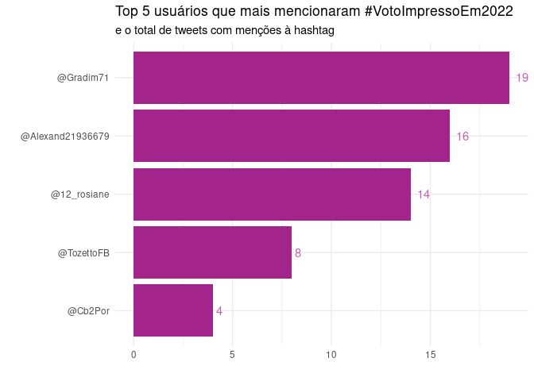
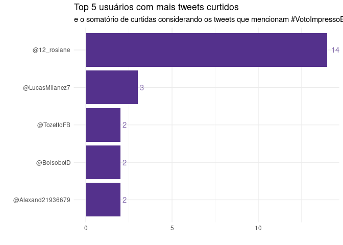
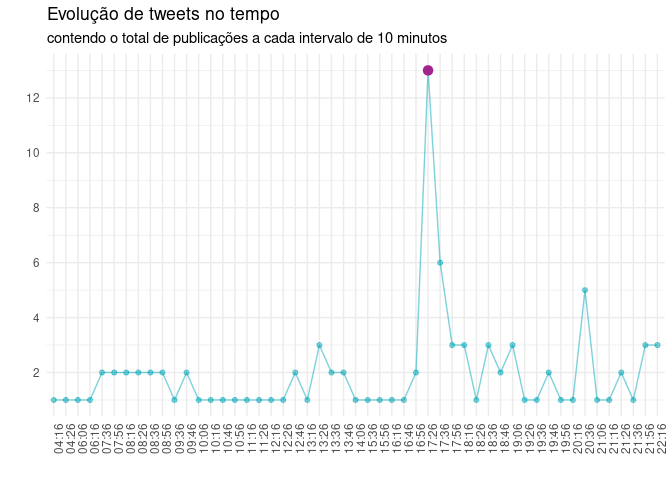
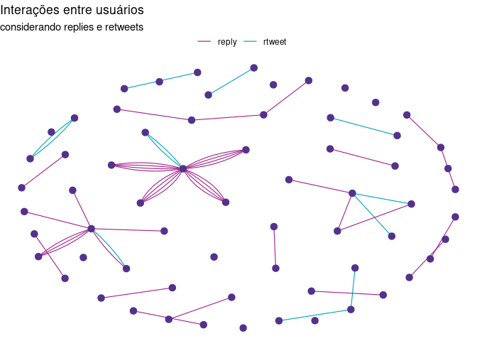
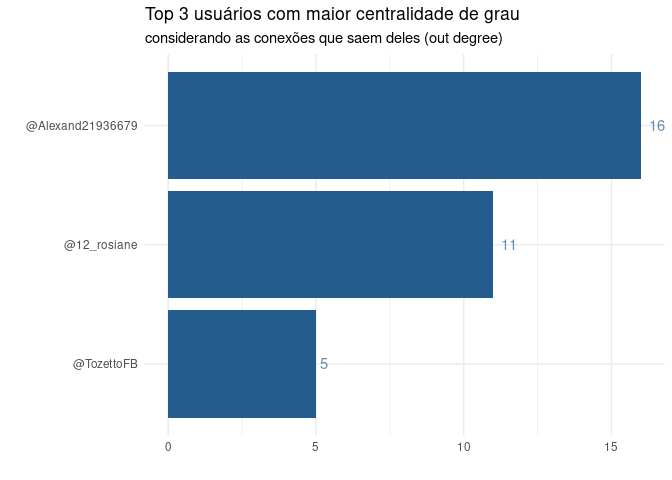
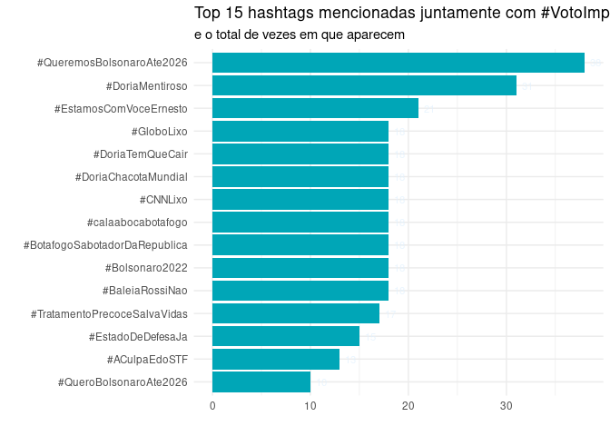
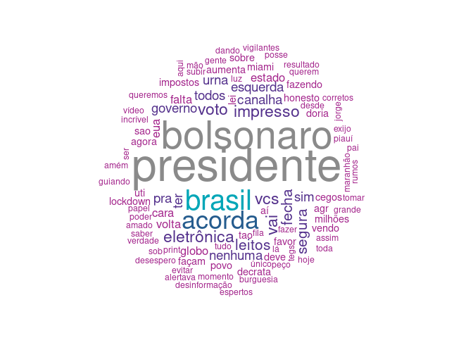

### **Sobre o exercício**

#### **O quê**

Coleta, limpeza e análise de um conjunto de dados do Twitter contendo os
100 tweets mais recentes que mencionam a hashtag \#VotoImpressoEm2022.

#### **Como**

Usando R e pacotes para coleta dos dados no Twitter, manipulação de
dados, análise de redes e visualização gráfica.

#### **Quando**

Dados referentes ao dia 22 de janeiro das 04h16 até 22h19.

#### **Por quê**

Processos de análise de dados e, mais especificamente, análise de redes
permitem a detecção de práticas que corroboram, por exemplo, para o
espalhamento de notícias falsas nas redes sociais. O resultado dessas
análises pode servir de apoio à estratégias para combater essas
práticas.

### **Overview dos dados**

Para obtenção dos 100 tweets mais recentes que mencionam
\#VotoImpressoEm2022, foi utilizado o pacote rtweet e a consulta
realizada da seguinte forma:

    tweets <- search_tweets(q = "#VotoImpressoEm2022", n = 100, type = "recent", parse = T)

O conjunto de dados possui então:

-   100 registros de tweets que mencionam \#VotoImpressoEm2022
-   90 atributos (colunas) contendo informações sobre os tweets
-   37 usuários únicos identificados
-   48 tweets são replies
-   17 tweets são retweets

A busca anterior retorna uma tabela, separada por 90 colunas (atributos)
que pode ser salva em um arquivo para consulta/manipulação posterior:

    fwrite(tweets, file ="tweets_votoimpresso2022_100.csv")

### **Análise dos perfis**

Para obter os cinco perfis (@) que tuitaram a hashtag mais vezes é
possível fazer uma contagem a partir do nome dos usuários, uma vez que
cada linha da base de dados representa um tweet:

    top5users_tweets <- tweets %>%
                            count(screen_name) %>%
                            arrange(-n) %>%
                            top_n(5) %>%
                            mutate(screen_name = paste0("@", screen_name))

    ## Selecting by n

    # Ajuste no dataframe para manter a ordenação no gráfico
    top5users_tweets$screen_name <- factor(top5users_tweets$screen_name,
                                           levels = top5users_tweets$screen_name[order(top5users_tweets$n)])

<!-- -->

Da mesma forma, para identificar os cinco perfis (@) que receberam mais
curtidas em seus tweets é possível realizar a contagem feita também a
partir do nome dos usuários, agregando pelo somatório de likes que cada
tweet recebeu:

    top5users_favorite <- tweets %>%
                            group_by(screen_name) %>%
                            summarise(total_favorite = sum(favorite_count)) %>%
                            arrange(-total_favorite) %>%
                            top_n(5) %>% # Ajustar aqui para pegar só 5
                            mutate(screen_name = paste0("@", screen_name))

    ## `summarise()` ungrouping output (override with `.groups` argument)

    ## Selecting by total_favorite

    top5users_favorite$screen_name <- factor(top5users_favorite$screen_name,
                                           levels = top5users_favorite$screen_name[order(top5users_favorite$total_favorite)])

<!-- -->

### **Evolução dos tweets no tempo**

A análise a seguir mostra a evolução de publicações de tweets que
mencionam a hashtag durante o período correspondente à coleta dos dados.
Para a visualização, a contagem é feita em intervalos de 10 minutos.

    tweets$bm <- cut(tweets$created_at, breaks = "10 min")
    freq_table <- count(tweets, bm)
    freq_table$bm <- format(strptime(freq_table$bm, "%Y-%m-%d %H:%M:%S"), format="%H:%M")
    max_freq <- freq_table[which(freq_table$n == max(freq_table$n)),]

<!-- -->

### **Análise da rede de usuários**

Uma forma de definir a relação entre usuários pode ser através de
replies e retweets que acontecem entre eles Para isso, é necessário
ajustar os dados para definir essas relações:

    # Obter a relação  usuário - retweetou - usuário
    retweet <- tweets[which(tweets$is_retweet == 'TRUE'),
                      c(1,4,54,55)]
    retweet$type <- 'rtweet'

    # Obter a relação  usuário - reply - usuário
    reply <- tweets[which(tweets$reply_to_user_id != ''),
                    c(1,4,9,10)]
    reply$type <- 'reply'

    # Ajustes para juntar as duas tabelas em uma só
    colnames(retweet) <- colnames(reply) <- c('from_user_id', 'from',
                                              'to_user_id', 'to', 'type')
    interacoes <- rbind(retweet, reply)
    interacoes <- interacoes[,c(2,4,1,3,5)]

    ## Construção da rede
    user_nodes <- unique(c(tweets$screen_name, interacoes$to)) # Obter a listagem de usuários únicos
    net <- graph_from_data_frame(d = interacoes, vertices = user_nodes, directed = T) # Construir a rede
    V(net)$color <- paleta_its[2] # Definir uma cor para os nós da rede

A rede resultou em 65 usuários e 65 areastas. Além disso, a rede é
direcionada, ou seja, mostra a direção relação (ex. quem retweetou
quem).

<!-- -->

Com a rede definida, é possível extrair métricas para analisar não só a
estrutura da rede, como, por exemplo, identificar os vértices mais
importantes. A identificação de vértices mais importantes em redes está
relacionada ao conceito de centralidade. Em redes sociais como o
Twitter, vértices com maior centralidade podem ser, por exemplo, os
usuários que possuem maior popularidade, prestígio, ou que atuam como
pontes para a disseminação de informação entre diferentes grupos.

Uma das formas mais simples de calcular a centralidade é contabilizar as
conexões de cada nó (centralidade de grau):

    # Checando centralidade de grau
    in_degree <- degree(net, mode = 'in') # Grau de entrada
    in_degree <- data.frame(screen_name = names(in_degree), in_degree = in_degree, row.names=NULL)
    out_degree <- degree(net, mode = 'out') # Grau de saída
    out_degree <- data.frame(screen_name = names(out_degree), out_degree = out_degree, row.names=NULL)
    all_degrees <- merge(in_degree, out_degree) # Combinando em uma única tabela

    # Principais usuários de acordo com a centralidade de grau (out)
    top3out_degree <- all_degrees %>%
        arrange(-out_degree) %>%
        top_n(3) %>%
        mutate(screen_name = paste0("@", screen_name))

    ## Selecting by out_degree

    top3out_degree$screen_name <- factor(top3out_degree$screen_name,
                                             levels = top3out_degree$screen_name[order(top3out_degree$out_degree)])

<!-- -->

### **Outras \# e temas relacionados**

Para as verificar quais outras hashtags aparecem junto à
\#VotoImpresso2022, podemos usar o atributo ‘text’ do conjunto de dados,
selecionar e contabilizar apenas as hashtags:

    outras_hashtags <- tweets %>%
        unnest_tokens(hashtags, text, "tweets", to_lower = FALSE) %>%
        filter(str_detect(hashtags, "^#"),
               hashtags != "#VotoImpressoEm2022") %>%
        count(hashtags, sort = TRUE)
    outras_hashtags$hashtags <- factor(outras_hashtags$hashtags,
                                             levels = outras_hashtags$hashtags[order(outras_hashtags$n)])

<!-- -->

Da mesma forma, para verificar outros temas também é necessário utilizar
a coluna ‘text’. Esses tweets compreendem um corpus que deve passar por
um processo de limpeza para retirar as hashtags, menções à outros
usuários, urls, emojis, números, pontuações e stopwords:

    text <- tweets$text
    removeHashtag <- content_transformer(function(x) gsub("#([a-z|A-Z|0-9|_|á-ú])*",'', x, perl = F))
    removeMencao <- content_transformer(function(x) gsub('@([a-z|A-Z|0-9|_])*', ' ', x, perl = F))
    removeURL <- content_transformer(function(x) gsub("(f|ht)tp(s?)://\\S+", '', x, perl = T))
    removeEmoji <- content_transformer(function(x) gsub('[^[:graph:]]', ' ', x, text, perl = F))
    corpus <- Corpus(VectorSource(text))
    f <- content_transformer(function(x) iconv(x, to = 'latin1', from = "UTF8", sub=''))
    corpus <- tm_map(corpus, f)
    corpus <- tm_map(corpus, removeEmoji)
    corpus <- tm_map(corpus, removeURL)
    corpus <- tm_map(corpus, removeMencao)
    corpus <- tm_map(corpus, content_transformer(tolower))
    corpus <- tm_map(corpus, removeHashtag)
    corpus <- tm_map(corpus, removePunctuation)
    corpus <- tm_map(corpus, removeNumbers)
    corpus = tm_map(corpus, removeWords, stopwords('pt'))

<!-- -->

### **Concluindo**

As análises apresentadas mostram uma visão geral do comportamento de
usuários que tuitaram \#VotoImpressoEm2022 durante o período
correspondente à coleta dos dados. É possível observar que a hashtag é
predominantemente compartilhada com outros temas que demonstram apoio ao
atual governo, incluindo a ideia de tratamento precoce da covid-19 e
descontentamento com a gestão do prefeito de SP, João Dória.

Para a análise de redes, foram identificados os usuários mais
importantes de acordo com a centralidade de grau, mas existe espaço para
a aplicação de outras métricas como centralidade de intermediação,
proximidade e identificação de comunidades de usuários que compartilham
características/interesses em comum. Isso pode ser especialmente útil
para um conjunto de dados maior.

Por fim, das análises é possível observar também o aparecimento do mesmo
conjunto de usuários. Uma consulta ao Pegabot para identificar qual a
probabilidade de serem bots indicou valores altos para os usuários
@Gradim71 (82%) e @Alexand21936679 (89%).
